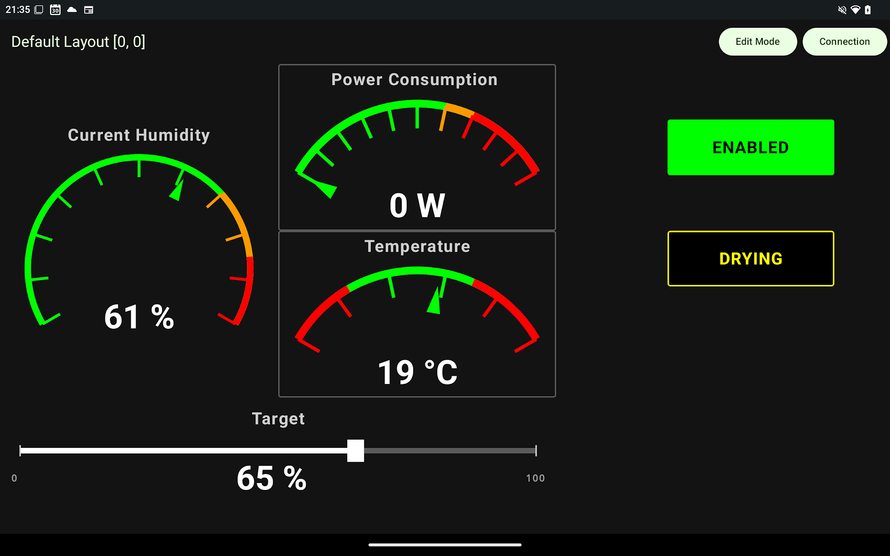
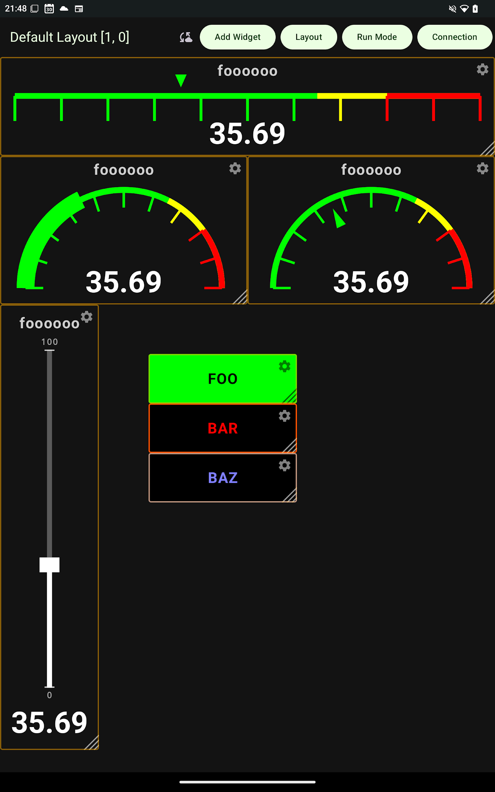

# HMI Control Panel

A drag-and-drop dashboard / control panel app that connects to home automation or industrial equipment over TCP and MQTT. Use any Android tablet as a custom HMI control panel.

## Key Features

- **Customizable Dashboards** -- Toggle between "Run Mode" for live operation and "Edit Mode" for layout design.
- **Drag-and-Drop Editor** -- Reposition gauges, sliders, and buttons directly on the screen.
- **Multiple PLC Protocols** -- Two protocols, one interface:
    - **Raw TCP** -- Direct socket communication using `TAG:VALUE` lines.
    - **MQTT v3.1.1** -- JSON payloads, QoS 1, and Last Will and Testament (LWT) for status signaling.
- **Real-time Updates** -- Low-latency UI powered by Kotlin StateFlow and Jetpack Compose.
- **Accessibility-First** -- 48dp minimum touch targets and screen-reader support built in.

## Tech Stack

- **Language**: [Kotlin](https://kotlinlang.org/)
- **UI Framework**: [Jetpack Compose](https://developer.android.com/jetpack/compose) (Declarative UI)
- **Architecture**: MVVM with [Unidirectional Data Flow (UDF)](https://developer.android.com/topic/architecture/ui-layer#udf)
- **Dependency Injection**: [Hilt](https://developer.android.com/training/dependency-injection/hilt-android)
- **Concurrency**: [Kotlin Coroutines](https://kotlinlang.org/docs/coroutines-overview.html) & [Flow](https://kotlinlang.org/docs/flow.html)
- **Local Persistence**: [Jetpack DataStore](https://developer.android.com/topic/libraries/architecture/datastore)
- **Navigation**: [Compose Navigation](https://developer.android.com/jetpack/compose/navigation)

## Core Principles

As defined in the project [Constitution](.specify/memory/constitution.md):

1.  **Compose-First** -- All UI is Jetpack Compose. No legacy Views.
2.  **Unidirectional Data Flow** -- State flows down, events flow up. This keeps UI behavior predictable.
3.  **Accessibility by Default** -- Minimum 48x48dp touch targets and dynamic text scaling, always.
4.  **Clarity by Design** -- Every screen should be readable at a glance.
5.  **Low Cognitive Load** -- Prioritize the most important information and reveal the rest progressively.
6.  **No Gimmicks** -- Every element and animation serves a real purpose.
7.  **Modular Architecture** -- UI, business logic, and protocol layers don't know about each other.

## User Interface Guide



### 1. Connection Screen
Configure your connection settings before opening a dashboard.
- **Protocol Selector** -- Choose between Raw TCP and MQTT.
- **Connection Parameters** -- Enter your IP/Host and Port.
- **MQTT Settings** -- Configure your Client ID, optional credentials, and Topic Prefix.
- **Connect/Disconnect** -- Establish or safely close your session.

### 2. Dashboard: Run Mode (Default)
Once connected, the app opens in **Run Mode** -- the live operational view.
- **Gauges** display incoming float values from the PLC in real time.
- **Sliders** send a float value to the PLC when you drag or release.
- **Buttons** send a boolean value to the PLC on press.

### 3. Dashboard: Edit Mode
Tap the **Edit Mode** button in the top app bar to customize the layout.



- **Drag-and-Drop** -- Long-press any widget to move it. New coordinates are saved instantly.
- **Add Widget** -- A palette appears at the bottom. Pick a control type (Button, Slider, Gauge) and place it.
- **Customization** --
    - **Labels** -- Override tag addresses with readable names.
    - **Background Color** -- Pick from a high-contrast palette, or use the **Custom Color Picker** (hex entry, visual spectrum, recent colors). Text color adjusts automatically for WCAG-compliant contrast.
    - **Font Scaling** -- Adjust text size per widget (0.5x to 2.5x) with the "Font Size" slider.

### 4. Demo Mode
The app includes a built-in simulation for testing without external hardware.
- **Local Demo Server** -- Tap "Connect to Local Demo Server" on the Connection Screen to launch a built-in simulation at `127.0.0.1:9999`.
- **Simulated Tags** -- Use `SIM_TEMP`, `SIM_PRESSURE`, or `SIM_STATUS` in your widgets to see live, fluctuating data.
- **Dynamic Attributes** -- Update widget appearance remotely via the protocol using `TAG.ATTR:VALUE`:
    - `MOTOR_01.label:Main Pump` (changes the display name)
    - `MOTOR_01.color:#FF0000` (changes the background to red)
- **JSON Import/Export** -- Back up or share layouts via raw JSON in Dashboard Settings.

## Building from Source

### Prerequisites

- **Android Studio** Jellyfish or newer
- **JDK** 17+
- **Android SDK** API 24 (Android 7.0) minimum, API 34+ target

### Option A: Android Studio (Recommended)
1.  Clone the repository.
2.  Open the project in Android Studio.
3.  Sync Gradle dependencies.
4.  Run the `app` module on a physical device or emulator.

### Option B: Command Line
If you prefer building without Android Studio, make sure you have **JDK 17** and a modern **Android SDK** (API 34) installed.

1.  **Set your SDK path** -- Create a `local.properties` file in the project root:
    ```properties
    sdk.dir=/path/to/your/android-sdk-linux
    ```

2.  **Accept licenses** (first time only):
    ```bash
    yes | sdkmanager --licenses
    ```

3.  **Build the APK**:
    ```bash
    ./gradlew :app:assembleDebug
    ```

4.  **Install to your device**:
    ```bash
    adb install app/build/outputs/apk/debug/app-debug.apk
    ```

## Documentation

- **[User Guide](docs/README.md)** -- Connection setup, dashboard usage, widget configuration, and system transfer.
- **[Development Guide](docs/development.md)** -- Architecture, project structure, how-to guides, and build troubleshooting.
