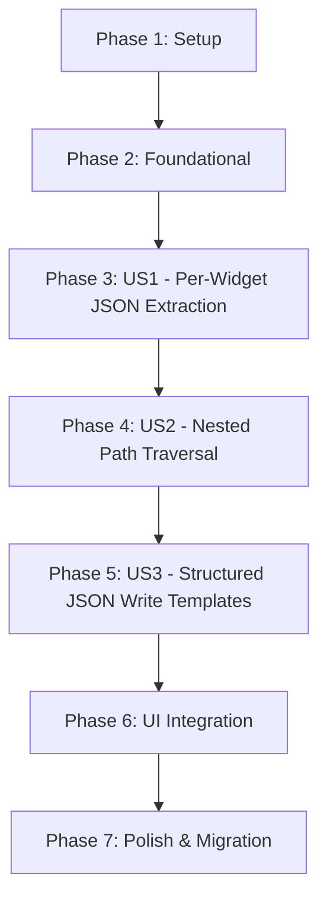

# Tasks: MQTT JSON Payload Support

**Feature Branch**: `031-mqtt-json-payload-support`
**Spec**: `/specs/031-mqtt-json-payload-support/spec.md`
**Implementation Plan**: `/specs/031-mqtt-json-payload-support/plan.md`

## Dependency Graph

## Parallel Execution Examples

- **Foundational**: T003 (Logic) and T004 (Tests) can be developed together.
- **UI**: T014 and T015 can be implemented in parallel within `WidgetPalette.kt`.

## Implementation Strategy

We will follow an incremental delivery approach, starting with the core parsing logic and the shared subscription model (MVP). Each user story will be independently testable via unit tests in the `:core:protocol` module before being exposed in the UI.

---

## Phase 1: Setup

- [X] T001 Add `jsonPath: String? = null` and `writeTemplate: String? = null` fields to `WidgetConfiguration.kt` in `app/src/main/java/com/example/hmi/data/WidgetConfiguration.kt`
- [X] T002 Verify `kotlinx.serialization` dependency and ProGuard rules in `core/protocol/build.gradle.kts`

## Phase 2: Foundational

- [X] T003 [P] Create `JsonPathUtils.kt` with `extractJsonPath(root: JsonElement, path: String): JsonPrimitive?` supporting single-key extraction in `core/protocol/src/main/java/com/example/hmi/protocol/utils/JsonPathUtils.kt`
- [X] T004 [P] Create `JsonPathUtilsTest.kt` to verify single-key extraction, missing keys, and non-JSON input in `core/protocol/src/test/java/com/example/hmi/protocol/utils/JsonPathUtilsTest.kt`
- [X] T005 Update `MqttPlcCommunicator.kt` private state to include a map for shared flows in `core/protocol/src/main/java/com/example/hmi/protocol/MqttPlcCommunicator.kt`

## Phase 3: US1 - Per-Widget JSON Extraction (Priority: P1)

**Story Goal**: Multiple widgets extracting different keys from a single shared topic subscription.
**Independent Test**: Verify that two separate `observeTag` calls on the same topic with different `jsonPath` values result in only one MQTT subscription and two distinct data streams.

**Interface change**: `observeTag` gains a `jsonPath: String? = null` parameter. This change ripples through:
- `PlcCommunicator` (interface definition)
- `PlcCommunicatorDispatcher` (pass-through)
- `RawTcpPlcCommunicator` (ignores `jsonPath`, raw TCP has no JSON mode)
- `DashboardViewModel` (passes `widget.jsonPath` when calling `observeTag`)

- [X] T005 Update `PlcCommunicator` interface: add `jsonPath: String? = null` parameter to `observeTag` in `core/protocol/src/main/java/com/example/hmi/protocol/PlcCommunicator.kt`
- [X] T006 Update `PlcCommunicatorDispatcher.observeTag` to pass through `jsonPath` in `core/protocol/src/main/java/com/example/hmi/protocol/PlcCommunicatorDispatcher.kt`
- [X] T007 Update `RawTcpPlcCommunicator.observeTag` signature to accept and ignore `jsonPath` in `core/protocol/src/main/java/com/example/hmi/protocol/RawTcpPlcCommunicator.kt`
- [X] T008 Refactor `MqttPlcCommunicator.observeTag` to use `SharedFlow` for raw payloads per topic, applying `jsonPath` extraction per-subscriber in `core/protocol/src/main/java/com/example/hmi/protocol/MqttPlcCommunicator.kt`
- [X] T009 Integrate `extractJsonPath` into the MQTT shared flow pipeline: when `jsonPath` is set, parse payload as JSON and extract; when null, fall back to global `payloadFormat`/`jsonKey` in `core/protocol/src/main/java/com/example/hmi/protocol/MqttPlcCommunicator.kt`
- [X] T010 Update `DashboardViewModel.observeTag` to pass `widget.jsonPath` through to `plcCommunicator.observeTag` in `app/src/main/java/com/example/hmi/dashboard/DashboardViewModel.kt`
- [X] T011 Add integration test for shared topic subscriptions with different `jsonPath` values in `core/protocol/src/test/java/com/example/hmi/protocol/MqttPlcCommunicatorTest.kt`

## Phase 4: US2 - Nested Path Traversal (Priority: P2)

**Story Goal**: Access deep JSON values using dot-notation (e.g., `status.motor.temp`).
**Independent Test**: Unit test `JsonPathUtils` with a 3-level deep JSON object and a dotted path.

- [X] T012 Enhance `JsonPathUtils.extractJsonPath` to support recursive dot-notation traversal and handle non-primitive leaf nodes (log warning, return null) in `core/protocol/src/main/java/com/example/hmi/protocol/utils/JsonPathUtils.kt`
- [X] T013 Add nested path test cases (3+ levels), non-primitive leaf, empty path, leading/trailing dots to `core/protocol/src/test/java/com/example/hmi/protocol/utils/JsonPathUtilsTest.kt`

## Phase 5: US3 - Structured JSON Write Templates (Priority: P2)

**Story Goal**: Wrap outgoing values in JSON using `$VALUE` substitution.
**Independent Test**: Mock MQTT client and verify that `writeTag` with a template publishes the correctly substituted JSON string.

**Interface change**: `writeTag` needs access to the widget's `writeTemplate`. Options:
- Add `writeTemplate: String? = null` parameter to `PlcCommunicator.writeTag` (same ripple as `observeTag`)
- Or apply the template in `DashboardViewModel` before calling `writeTag` with a `StringValue`

The ViewModel approach is simpler — the communicator stays template-unaware:

- [X] T014 Implement `$VALUE` substitution in `DashboardViewModel`: when `widget.writeTemplate` is set, substitute and send as `PlcValue.StringValue`; otherwise send as current type in `app/src/main/java/com/example/hmi/dashboard/DashboardViewModel.kt`
- [X] T015 Add unit test for write template substitution: numeric `$VALUE`, string `"$VALUE"`, no-token static template, null template fallback in `app/src/test/java/com/example/hmi/dashboard/DashboardViewModelTest.kt`

## Phase 6: UI Integration

- [X] T016 [P] Add "JSON Path" `OutlinedTextField` to `WidgetConfigDialog` for all widget types (below Tag Address, with placeholder "e.g., sensors.temperature") in `app/src/main/java/com/example/hmi/dashboard/WidgetPalette.kt`
- [X] T017 [P] Add "Write Template" `OutlinedTextField` to `WidgetConfigDialog` for Slider and Button types (below Write Topic, with placeholder `e.g., {"humidity": $VALUE}`) in `app/src/main/java/com/example/hmi/dashboard/WidgetPalette.kt`
- [X] T018 Wire `jsonPath` and `writeTemplate` into the `onConfirm` copy block in `WidgetConfigDialog` in `app/src/main/java/com/example/hmi/dashboard/WidgetPalette.kt`
- [X] T019 Pass `widget.writeTemplate` from `DashboardScreen` through to `onSliderChange` and button press handlers in `app/src/main/java/com/example/hmi/dashboard/DashboardScreen.kt`

## Phase 7: Polish & Migration

- [X] T020 Implement auto-migration: if global `MqttSettings.payloadFormat == JSON` and `jsonKey` is set, propagate `jsonKey` into each widget's `jsonPath` on first load in `app/src/main/java/com/example/hmi/data/LayoutMigrationManager.kt`
- [X] T021 Update `docs/widget-configuration.md` with JSON Path and Write Template field documentation
- [X] T022 Update `docs/connection-guide.md` with per-widget JSON extraction examples
